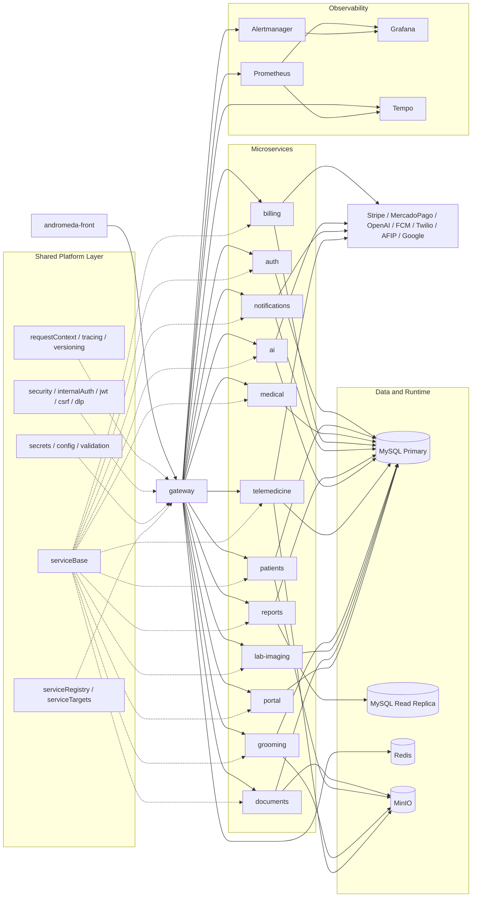

# Arquitectura

## Resumen

VetManager Pro usa un `gateway` Node/Express delante de microservicios Node. El gateway valida auth, aplica controles de seguridad, inyecta contexto de usuario y proxyea a los servicios internos con firma HMAC.

## Diagrama

## Topologia formal

- `gateway` actua como edge unico y concentra auth, versionado, DLP, CSRF, rate limiting, tracing y proxy.
- Los servicios de dominio resuelven permisos y validaciones por su propia capa shared, no en el gateway.
- `serviceBase` estandariza `health`, `metrics`, `requestId`, `traceId`, validacion OpenAPI y lifecycle.
- `serviceRegistry` y `serviceTargets` resuelven runtime, registry y DNS/health-aware selection.
- Observabilidad queda separada en Prometheus, Grafana, Tempo y Alertmanager.

## Decisiones actuales

- Escrituras van al primario MySQL.
- Lecturas pesadas de reportes pueden ir a `MYSQL_READ_*`.
- Redis se usa para revocacion de JWT, rate limiting, RBAC cache y pub/sub.
- En produccion, la verificacion de revocacion JWT falla cerrada si Redis no esta disponible.
- El discovery ya no depende de una sola fuente: runtime/DNS es la ruta principal y Redis queda como compatibilidad o metadata.
- `eventBus` usa Redis Streams con outbox persistente en MySQL para no perder eventos cuando Redis esta caido.
- Notificaciones fallidas se encolan en `notification_retry_jobs`.
- IA usa circuit breaker para no bloquear toda la consulta cuando falla el proveedor.
- Los servicios documentados hoy incluyen `documents`, que expone inbox, uploads, downloads y presigned URLs.
- La rotacion JWT puede hacerse con `JWT_KEYRING_JSON` y `kid`; `npm run secrets:jwt-rotate` genera el material para un rolling deploy. AWS Secrets Manager o Vault siguen siendo opciones validas para distribuir ese secreto, no un requisito del runtime.

## Riesgos todavia abiertos

- Sin broker dedicado de clase Kafka/RabbitMQ; el outbox MySQL + Redis Streams cubre durabilidad basica de eventos internos.
- Frontend sigue en JavaScript sin TypeScript.
- Hay E2E frontend con Playwright en `andromeda-front/tests/e2e` y job dedicado en CI.
